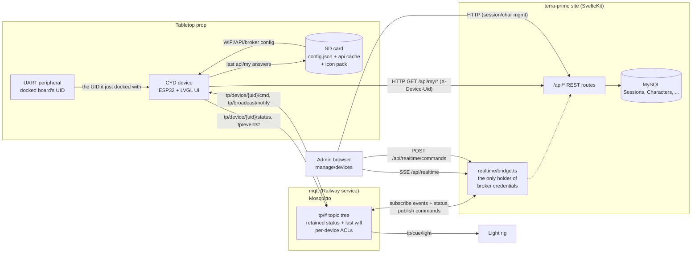
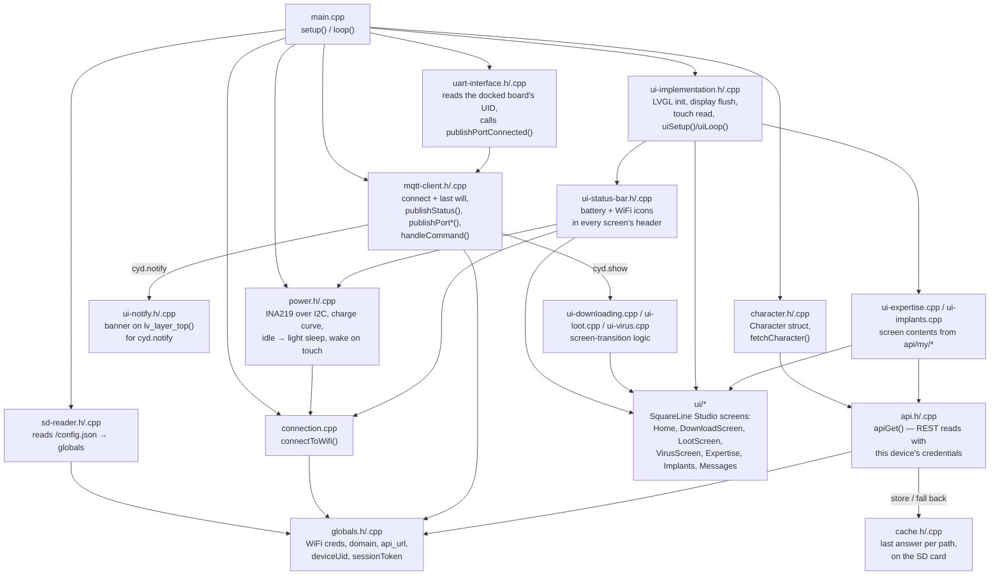
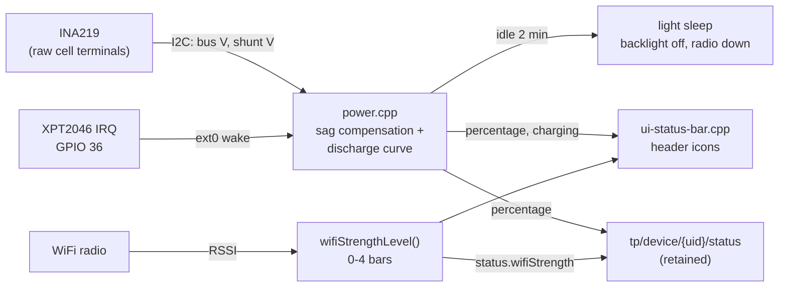
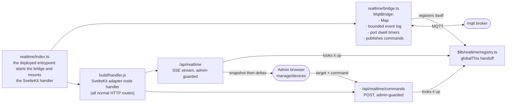
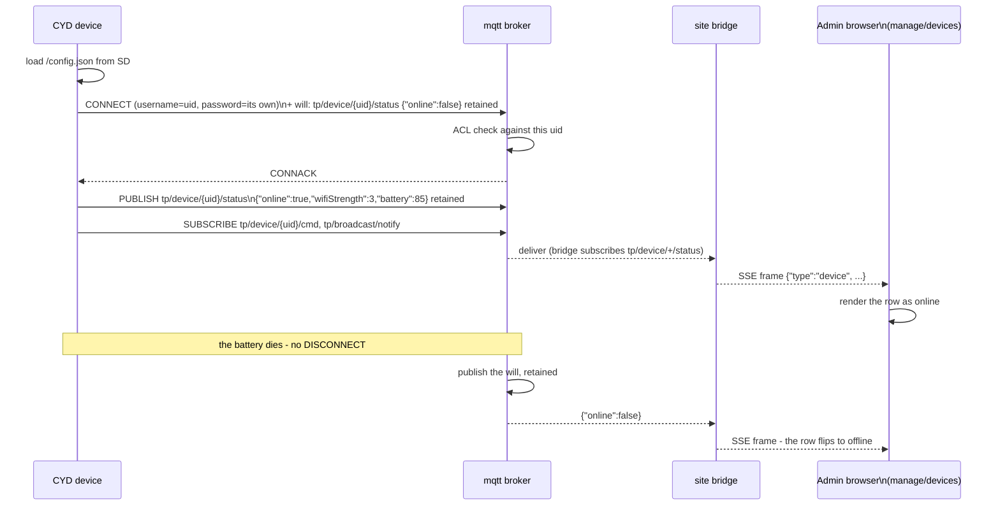
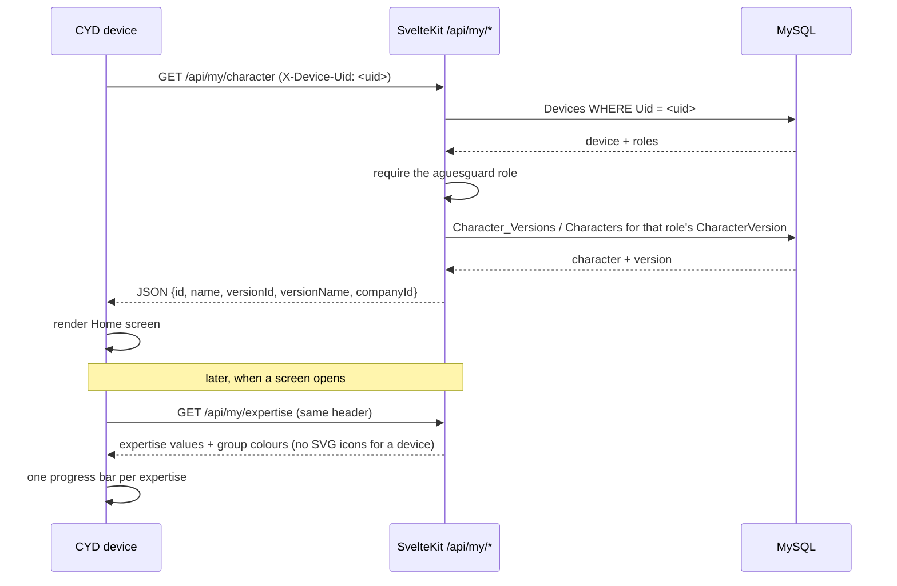
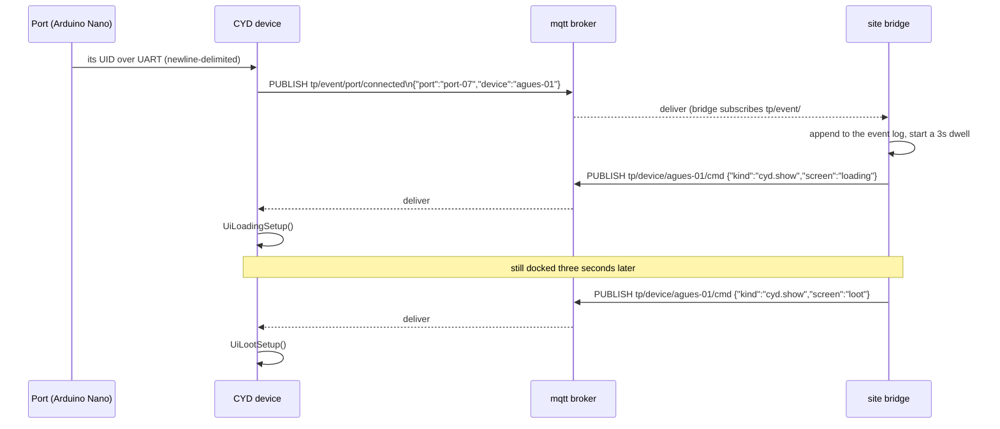
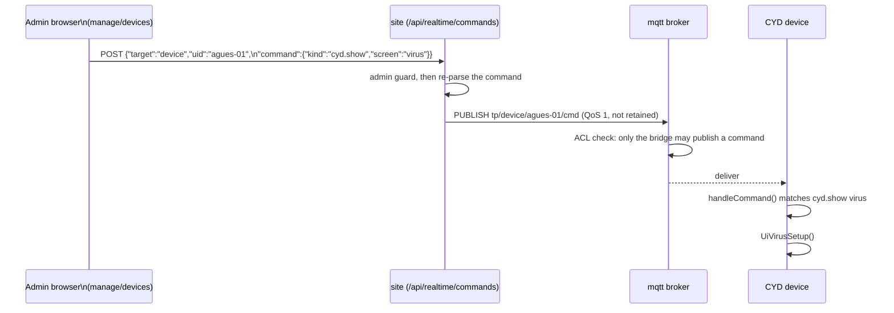

# CYD Design Document

> Architecture and data-flow reference for the **CYD** ("Cheap Yellow Display") tabletop-prop
> device and how it interacts with the terra-prime site. Diagrams are [Mermaid](https://mermaid.js.org/)
> — edit the fenced code blocks directly and re-render (e.g. on [mermaid.live](https://mermaid.live))
> to adjust them.

## 1. Overview

**CYD** stands for "Cheap Yellow Display" — a low-cost ESP32 development board with an
integrated 320x240 ILI9341 TFT screen and an XPT2046 resistive touch controller (named after
the well-known RandomNerdTutorials hardware guide). In this repo, `cyd/` is a PlatformIO/Arduino
firmware project that turns one of these boards into a **physical tabletop-RPG companion prop**:
it sits at a player's table during a live session, renders character stats and animated
screens (loading / loot / virus / expertise / implants / messages) built with
**LVGL** + **SquareLine Studio**, and reacts in real time to commands pushed from the server.

The device is not autonomous — it is a thin client. All game logic, session state, and
character data live on the site (SvelteKit + MySQL). CYD talks to the site over four channels:

| Channel | Direction | Purpose |
|---|---|---|
| HTTP (REST) | device → server | `GET /api/my/*` — character at boot, expertise and implants when those screens open |
| MQTT | bidirectional | status and events out, commands in ([§3.2](#32-the-mqtt-transport)) |
| UART (serial) | external peripheral → device | receives the UID of the board this prop just docked with, reported as a `port.connected` event |
| SD card | local | loads `/config.json` at boot (WiFi creds, API URL, broker address and credential, `deviceUid`, `sessionToken`) and the expertise icon pack; stores the last answer per `api/my` path for offline use |
| I2C | sense IC → device | INA219 on the battery terminals: pack voltage and current, for the charge readout ([§3.1](#31-power-and-signal-telemetry)) |

The admin-facing `manage/devices` dashboard does **not** connect to the broker. It holds an SSE
stream against the site, which runs a bridge that is the only thing in the system holding broker
credentials — so nothing a browser can read gets a client onto the broker, and authorisation stays
in the same place as every other admin route. Deployment and credential issuing are in
[`MQTT_SETUP.md`](./MQTT_SETUP.md).

---

## 2. System context

---

## 3. CYD firmware components

> Note: as of the current firmware, `main.cpp` boots directly into the UI with SD/WiFi/
> character-fetch/MQTT init **commented out** (dev-mode state) — see `cyd/CLAUDE.md`.

### 3.1 Power and signal telemetry

The prop is untethered: it runs an evening at the table off two 18650 cells on a "V8" shield, which
wires them in **parallel** behind a 5V boost converter. Two things follow from that, and both live
outside the generated UI.

**Knowing the charge.** The boosted 5V rail says nothing about the cells — it reads a flat 5V until
the converter gives up. So an **INA219** sits across the shield's *raw* cell terminals and reports
bus voltage and current over I2C (SDA 27, SCL 22 — clear of the display and touch SPI buses; no ADC
pin). A pack under load sags well below its resting voltage, so `power.cpp` adds the I·R drop back
from the current reading before looking the voltage up in a single-cell 18650 discharge curve. The
sense IC is optional: with none on the bus every reading comes back unmetered and the status bar
says `--` rather than inventing a number.

**Making the charge last.** After two minutes without a touch — LVGL's own inactivity timer — the
backlight goes out and the ESP32 enters **light** sleep. Light rather than deep is the whole point:
RAM and the call stack survive, so the screen the player left is still built and still holds its
data. The XPT2046 pulls its IRQ line (GPIO 36) low on touch, and that is the `ext0` wake source.
The radio cannot stay associated through light sleep, so it is taken down deliberately and
`reconnectWifi()` brings it back on wake; the MQTT client reconnects itself from there, and a
screen opened before the link is back fills from the SD cache ([§3](#3-cyd-firmware-components)).

**Signal strength** is read from the radio as RSSI and bucketed into 0–4 bars
(`wifiStrengthLevel()`). The bars go two places: the header icon, and the `wifiStrength` field of
the device's retained status topic. Charge rides along with it, bracketed to 5% so a discharging
pack does not publish a message a second. A status is otherwise sent once on connect, so a handheld
walking out of range would sit in the admin list showing full bars — the device re-announces
whenever either reading changes bracket.

### 3.2 The MQTT transport

The device used to hold a WebSocket to the site. Two things that could not do are why it no longer
does.

**A prop whose battery dies just stops answering**, and nothing on the server could tell that from
a device that simply had nothing to say. MQTT's **last will** is registered in CONNECT and
published by the broker when the session ends without a DISCONNECT, so "this prop is gone" arrives
on its own with no heartbeat logic anywhere.

**A device that rebooted used to come back invisible** until it announced itself. Its status topic
is **retained**, so the broker hands the last known state of every prop to anything that
subscribes — which is how the site recovers the whole fleet within a second of a redeploy without
waking a single device. There is no connection table; there never was, and now there does not need
to be one.

The topic tree is the device-facing API and is defined once, in
`site/src/lib/realtime/topics.ts`. These strings are flashed into hardware that gets handed to
players, so changing one means collecting every prop in the building:

| Topic | Who publishes | Notes |
|---|---|---|
| `tp/device/<uid>/status` | the device | retained, and the last-will topic |
| `tp/device/<uid>/cmd` | the site bridge | `cyd.show`, `cyd.notify`; subscribed by that device only |
| `tp/event/port/connected` / `.../disconnected` | an AguesGuard | docking with a Port |
| `tp/event/printer/connected` | an AguesGuard | docking with a Printer |
| `tp/event/game/won` | a Game | the winning player is in the payload |
| `tp/event/print/taken` | an AguesGuard | a player taking prints off a Printer |
| `tp/cue/light` | the site bridge | the light rig subscribes to exactly this and understands nothing else |
| `tp/broadcast/notify` | the site bridge | every prop subscribes |

Events are **facts, not commands**: a prop says what happened to it and does not care who acts on
it. That is what lets a Game claim a Port by subscribing to its UID, with no registry change and no
behaviour configured on the Port itself.

Each device authenticates with its own username and password and is confined by a broker ACL to
its own subtree plus the event topics its roles justify — a prop is handed to a player, so a shared
credential would make one lost handheld enough to drive every screen in the room. A device may
never publish a command. Issuing the credentials is [`MQTT_SETUP.md`](./MQTT_SETUP.md) §3.

---

## 4. Site-side realtime layer

**One process, not two.** The fleet's live state is in the bridge's memory and `/api/realtime`
streams it, so they have to share it. A route cannot reach the bridge by importing it —
`build/handler.js` is a bundle, and `$lib/realtime/*` inside it is a *copy* of the module the
bridge imported, which would make the singleton quietly become two. The bridge parks itself on
`globalThis` under a registered symbol instead, and routes look it up from there.
`getRealtimeBridge()` returning null is a normal state: it is what `vite dev` and `pnpm start` look
like, and both endpoints answer 503 rather than streaming silence.

**The browser never names a topic.** It posts a target (`device`, `broadcast`, `light`) and a
command, and the site decides which topic that is. The topic tree stays server-side, and a leaked
admin session cannot publish somewhere the dashboard was never meant to reach.

**The port dwell rule** lives in the bridge. An AguesGuard docking with a Port gets a `loading`
screen, and if it is still docked three seconds later, `loot`. It replaces the relay's link timer,
which could only approximate a dwell by watching repeated pings land inside a 3000–4800ms window;
`port/connected` and `port/disconnected` say it outright. A device going offline mid-dock cancels
it too — its last will is the only notice anyone gets, and without that the Port would open for a
dead prop.

**The event log** is one structured line per event on stdout, where the deployment's log drain is
the durable copy, plus a bounded in-memory tail for the dashboard's first frame. There is no event
table in the schema yet; `appendToEventLog()` is the single place that changes when there is one.

---

## 5. Sequence diagrams

### 5.1 Boot / status handshake

### 5.2 Character fetch, and the device's own reads

The device asserts nothing about which character it is showing: it presents the UID it is
registered under in `Devices`, and the server reads the bound character version from that device's
`aguesguard` role. Re-binding a handheld is an admin edit of that role — nothing to reflash, no SD
card to rewrite. `/api/my/**` serves a player's browser over the session cookie by the same route.

Every answer is also written to the SD card, and every failed request falls back to the last one
stored for that path, so a prop that loses WiFi mid-event keeps showing the player their own sheet.
Each stored body records the character version it belongs to and is refused if that no longer
matches, so a re-bound handheld never falls back to the previous player's numbers. Whether an answer
came from the card is reported back to the caller but not drawn on the screens: the header's WiFi
icon is where "these values are old" belongs, and nothing drives it yet — see
[§7.4](#7-known-architecture-gaps).

### 5.3 Docking with a Port, and the dwell

An undock (`tp/event/port/disconnected`) cancels the dwell, and so does the device's last will:
a prop that dies mid-dock must not open the Port on its way out.

### 5.4 Admin-triggered screen push

Commands are never retained: retaining one would re-fire on every reconnect, so a prop that lost
WiFi would replay the last screen change forever.

---

## 6. Data model touchpoints

| Table | CYD reads | CYD writes | Notes |
|---|---|---|---|
| `Sessions` / `Session_Roles` | `sessionToken` is provisioned into `/config.json` on the SD card out-of-band | — (no direct writes) | Only a REST fallback now: the broker authenticates a device against its own credential, not against a session token |
| `Devices` / `Device_AguesGuard` | indirectly: the device sends its `Uid`, the server resolves the role's `CharacterVersion` | — | The device's identity on the REST channel, and the username its broker credential is issued against. A UID is a bearer credential sent in the clear — see [§7.1](#7-known-architecture-gaps) |
| `Characters` / `Character_Versions` | via `GET /api/my/character` (`name`, `versionId`, `versionName`) | — | Fetched once at boot (when enabled) to populate the Home screen |
| `Character_Version_Expertise` / `Expertise` / `Expertise_Groups` | via `GET /api/my/expertise` (value, name, group name and colour) | — | Re-read every time the Expertise screen opens, and cached on the SD card for when that read fails. The SVG icons are withheld from device callers; the device draws 24px A8 copies from its card instead, exported from `manage/expertise` and tinted at draw time with the group colour |
| `Character_Version_Implants` / `Implants` | via `GET /api/my/implants` (name, description, slot) | — | Re-read every time the Implants screen opens, and cached on the SD card for when that read fails |

Full schema reference: `site/CLAUDE.md`. Full REST endpoint reference: `site/src/routes/api/CLAUDE.md`.

---

## 7. Known architecture gaps

These are real, current gaps found while tracing the CYD ⇄ site integration — documented here
so they're visible, not silently worked around.

1. **Device identity on the REST channel is a bearer UID.** The firmware's REST reads authenticate
   — as the device, not as a player — but `X-Device-Uid` is a plain identifier sent in the clear,
   so anyone who can read one off the wire can replay it and read that character. The realtime
   channel no longer has this problem: the broker checks a per-device password and confines each
   prop with an ACL. Closing it on REST means the same kind of per-device secret on `Devices`,
   presented per request; nothing does that yet.

2. **Device traffic to the broker is plaintext.** Railway does not terminate TLS on a TCP proxy,
   so `mqtt://` rather than `mqtts://` — see [`MQTT_SETUP.md`](./MQTT_SETUP.md) §1. The credential
   is the thing worth protecting and each one is scoped to a single prop, but the payloads are
   readable by anyone on the path. Moving to TLS means the broker holding its own certificate and
   a check that the ESP32 has the RAM for mbedTLS next to LVGL's display buffers.

3. **The event log is not durable.** The bridge writes one structured line per event to stdout and
   keeps a bounded in-memory tail; there is no event table in the schema. Everything older than
   the tail is only in the deployment's log drain.

4. **Nothing a device sends is delivery-guaranteed.** PubSubClient publishes at QoS 0 only, so an
   event a prop reports while its WiFi is dropping is simply gone — there is no PUBACK and no
   retry. Retained status is unaffected (the broker keeps the last one it did receive), and the
   event topics are the exposure. Fixing it means a client that implements QoS 1 publishing,
   `espMqttClient` being the usual answer.

5. **A command to an offline prop is lost.** The firmware connects with a clean session, so the
   broker queues nothing for a device that is not there. That is the right default for screen
   changes — a `cyd.show` that arrives ten minutes late is worse than one that never arrives — but
   it means there is no such thing as a durable command.

6. **Nothing tells the player the values are old.** The device falls back to the copy on its SD
   card when a request fails, and `ApiResult.stale` marks that body as stored rather than live, but
   no screen shows it. The header's WiFi icon is the intended home for it and is a static image
   today, as is the header's clock. Until one of them is driven, a player cannot tell a cached
   sheet from a current one.

---

## 8. File / reference index

| Diagram element | File(s) |
|---|---|
| Firmware entry / lifecycle | `cyd/src/main.cpp` |
| Firmware shared state | `cyd/src/globals.h`, `cyd/src/globals.cpp` |
| SD config loading | `cyd/src/sd-reader.h`, `cyd/src/sd-reader.cpp` |
| Offline cache on the card | `cyd/src/cache.h`, `cyd/src/cache.cpp` |
| Icon pack export | `site/src/lib/utils/icon-export.ts`, `.../lvgl-image.ts`, `.../zip.ts`, `.../rasterize-svg.ts` |
| WiFi connect, reconnect, RSSI → bars | `cyd/src/connection.cpp` |
| Battery metering and power save | `cyd/src/power.h`, `cyd/src/power.cpp` |
| Header battery / WiFi icons | `cyd/src/ui-status-bar.h`, `cyd/src/ui-status-bar.cpp` |
| MQTT client | `cyd/src/mqtt-client.h`, `cyd/src/mqtt-client.cpp` |
| Notification banner | `cyd/src/ui-notify.h`, `cyd/src/ui-notify.cpp` |
| REST client / credentials | `cyd/src/api.h`, `cyd/src/api.cpp` |
| Character fetch | `cyd/src/character.h`, `cyd/src/character.cpp` |
| UART token input | `cyd/src/uart-interface.h`, `cyd/src/uart-interface.cpp` |
| LVGL/display glue | `cyd/src/ui-implementation.h`, `cyd/src/ui-implementation.cpp` |
| Screen-transition logic | `cyd/src/ui-downloading.cpp`, `cyd/src/ui-loot.cpp`, `cyd/src/ui-virus.cpp` |
| Screen contents from the API | `cyd/src/ui-expertise.cpp`, `cyd/src/ui-implants.cpp` |
| SquareLine-generated screens | `cyd/src/ui/*` |
| SquareLine project source | `cyd/ui-project/cyd-interface.spj` |
| Firmware architecture notes | `cyd/CLAUDE.md` |
| Deployed entrypoint | `site/realtime/index.ts` |
| Site bridge | `site/realtime/bridge.ts` |
| Topic tree, payloads, SSE frames | `site/src/lib/realtime/topics.ts`, `.../messages.ts`, `.../stream.ts` |
| Bridge handoff into SvelteKit | `site/src/lib/realtime/registry.ts` |
| Dashboard endpoints | `site/src/routes/api/realtime/+server.ts`, `.../realtime/commands/+server.ts` |
| Dashboard state | `site/src/lib/managers/realtime-manager.svelte.ts` |
| Admin live dashboard | `site/src/routes/manage/devices/+page.svelte` |
| Broker service | `mqtt/Dockerfile`, `mqtt/mosquitto.conf`, `mqtt/entrypoint.sh`, `mqtt/railway.toml` |
| Per-device credentials | `site/db/mqtt-credentials.ts` |
| Broker deployment guide | `docs/MQTT_SETUP.md` |
| Player/device read paths | `site/src/routes/api/my/character/`, `.../my/expertise/`, `.../my/implants/` |
| Caller → character version | `site/src/lib/server/my-character.service.ts` |
| Device registry | `site/src/lib/db/device.repo.ts`, `site/src/lib/db/schema/devices.ts` |
| Site schema reference | `site/CLAUDE.md` |
| Site API reference | `site/src/routes/api/CLAUDE.md` |
| Deployment config | `site/dockerfile`, `site/railway.toml`, `site/package.json` |
