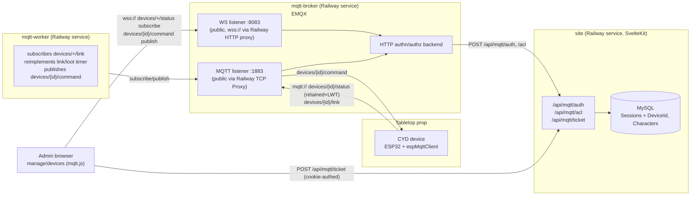
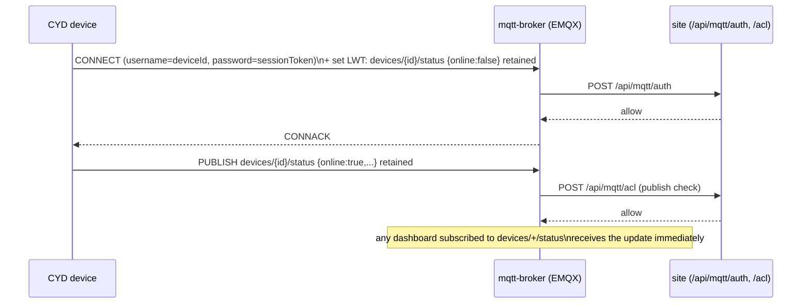
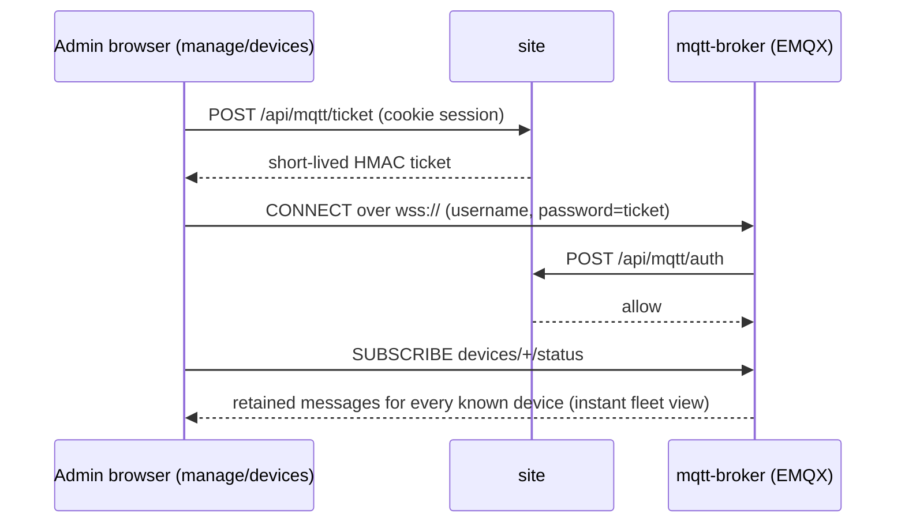
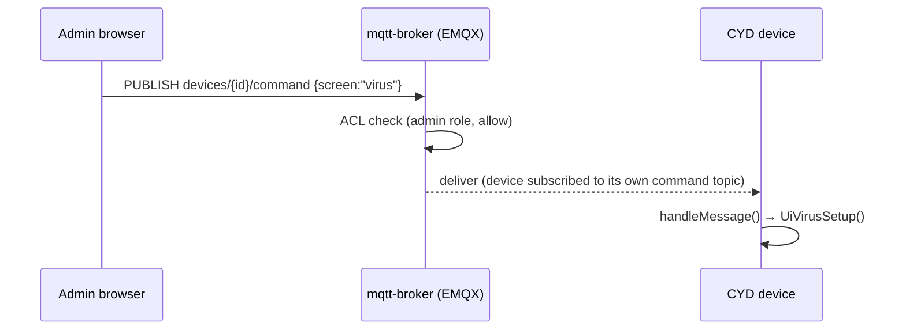
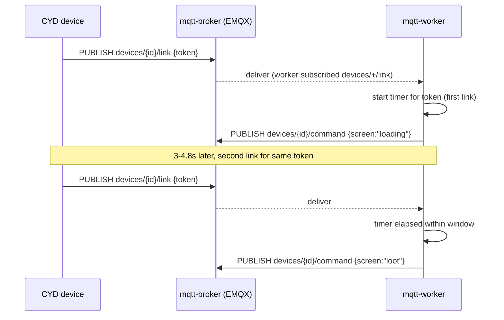

# MQTT Migration Design Document

> Architecture and migration plan for replacing the hand-rolled WebSocket relay
> (`site/websocket-server/`) with an MQTT-based realtime layer for CYD ⇄ site
> communication, and for enabling a future full fleet-management dashboard. Companion to
> [`docs/CYD_DESIGN.md`](./CYD_DESIGN.md), which documents the *current* architecture this
> doc supersedes. Diagrams are [Mermaid](https://mermaid.js.org/) — edit the fenced code
> blocks directly and re-render (e.g. on [mermaid.live](https://mermaid.live)) to adjust
> them.

## 1. Why migrate

Today, CYD devices and the admin `manage/sessions` dashboard both talk to a single
hand-rolled WebSocket relay (`site/websocket-server/`, built on the `ws` library) at
`/connections`. It multiplexes two very different client types over one unauthenticated
channel, distinguished only by a self-reported `connectionType` field — any TCP client
can connect and claim any `sessionToken`. State lives in a single process's in-memory
`Map`, broadcasting the *entire* connection list on every change. It doesn't survive a
restart and can't scale past one instance.

Worse, **this layer is currently dead in production** (`docs/CYD_DESIGN.md` §7, gap 1):
`site/dockerfile`'s prod `CMD` runs `pnpm start`, not `pnpm start:websocket`, so
`/connections` isn't even reachable today. This means there is no live production
traffic to protect during this migration — it's a clean architectural fix, not a
delicate cutover.

The goal beyond just fixing this is a future full admin dashboard: a live overview of
all connected CYDs, and the ability to send messages / force navigation to individual
devices or the whole fleet. MQTT is purpose-built for this kind of device-fleet
presence + command fan-out:
- Last-Will-and-Testament (LWT) gives free, reliable "device went offline" detection —
  no more hand-rolled heartbeat/Map bookkeeping.
- Retained messages mean a dashboard that just opened immediately sees the last-known
  state of every device, per device, with no custom "broadcast full list" logic.
- Per-device topics map naturally to "send a command to one device," and give
  broker-level ACLs instead of today's zero-auth shared socket.

## 2. Key finding that shapes the design

`sessionToken` today is **not** a device concept — it's literally a row in the
human-auth `Sessions`/`Session_Roles` tables, hand-copied onto a CYD's SD card. There is
no `Devices` table, no device role, nothing in the DB that distinguishes "a physical
prop" from "a human's login session." The `connectionType: 'CYD' | 'Web'` split rendered
in the dashboard today is 100% client-asserted JSON, not backed by anything server-side.
This is the real root cause of "no auth at the socket level," and the MQTT migration
fixes it rather than relocating it, by introducing a proper `device` role and a public
`DeviceId` distinct from the secret `sessionToken`.

## 3. Target architecture



### 3.1 Broker: EMQX, self-hosted on Railway

`emqx/emqx` official Docker image, deployed as a **third Railway service** alongside
`site` (and the new `mqtt-worker`, §3.4). Chosen over Mosquitto+go-auth (compiled `.so`
plugin) and VerneMQ (smaller community, less turnkey WS/observability) because EMQX
uniquely satisfies all of:
- Native MQTT-over-WebSocket listener (port 8083/8084) enabled out of the box.
- Native HTTP-based authentication *and* authorization (ACL) backends, configured purely
  via env vars/config — no custom compiled plugin.
- Config entirely driven by env vars, mapping cleanly onto a Railway service.

Topology on Railway:
- **WS listener**, exposed via Railway's automatic HTTP domain proxy → free `wss://`
  with zero cert management (Railway terminates TLS at the edge). This is what the
  browser dashboard uses.
- **Raw MQTT listener** (1883), exposed via Railway's TCP Proxy for devices. Railway
  does *not* terminate TLS on TCP-proxied ports, so device-side `mqtts://` would require
  EMQX to hold/renew its own cert — real added ops burden. **v1: plaintext MQTT for
  devices over the TCP proxy, TLS as an explicit fast-follow**, given the tabletop
  prop's local/short-session nature. This is a conscious risk acceptance (§6).
- A Railway volume for EMQX's data dir so retained state survives redeploys.
- EMQX's own admin dashboard (port 18083) is **not** exposed publicly — private
  network / CLI access only, separate from the app's own `manage/devices` page.
- Auth webhooks are called over Railway's **private network**
  (`http://site.railway.internal:.../api/mqtt/...`), never exposed publicly.

### 3.2 Topic schema

```
devices/{deviceId}/status         retained, LWT target     device → broker (presence + state)
devices/{deviceId}/command        QoS1                      admin/worker → device (goTo/navigation)
devices/{deviceId}/link           QoS1                      device → worker (RFID/NFC scan)
devices/broadcast/command         QoS1                      admin/worker → all devices (fleet push)
```

- Identity split: **`deviceId`** (public slug, used in topics + MQTT username) vs.
  **`sessionToken`** (secret, used only as the MQTT password at CONNECT) — replaces
  today's conflation of the two.
- `devices/{deviceId}/status` is retained + backed by LWT (`{online:false}` published
  automatically by the broker on ungraceful disconnect). A dashboard subscribing to
  `devices/+/status` gets the whole fleet's last-known state instantly — this directly
  replaces the old "broadcast full list on every change" pattern, and is the backbone of
  the "overview of all connected CYDs" dashboard view with no extra aggregation endpoint.
- `devices/{deviceId}/command` keeps the same payload shape as today's `goTo` message
  (`{screen, data?, ts, commandId}`) so the firmware's screen-transition code
  (`ui-downloading.cpp`/`ui-loot.cpp`/`ui-virus.cpp`) doesn't need to change.
- `devices/broadcast/command` is a new capability MQTT gives for free: push to the whole
  fleet without looping over open sockets server-side.
- Devices connect with a persistent session (`cleanSession=false`) so QoS1 commands
  queue at the broker across brief WiFi drops.

### 3.3 Auth model

Schema: add `'device'` to `UserRole` (`site/src/lib/types/roles.ts`) and a nullable
unique `DeviceId` column on `Sessions` (new migration), populated when role includes
`device`. Extend the existing `manage/sessions/new` provisioning flow to accept a
`deviceId` slug for device rows — reuses the existing token-issuance UI instead of a new
"Devices" CRUD surface.

New SvelteKit endpoints:
- **`POST /api/mqtt/auth`** — EMQX's HTTP authn backend calls this on every CONNECT.
  - Device path: `username=deviceId`, `password=sessionToken`. Look up via the existing
    `sessionRepo` credential lookup, confirm role includes `device` *and* the row's
    `DeviceId` matches the presented username (stops a leaked token being replayed under
    a different device identity).
  - Browser/admin path: `password` is a short-lived signed ticket (below).
  - Default deny otherwise.
- **`POST /api/mqtt/acl`** — EMQX's HTTP authz backend, called per PUBLISH/SUBSCRIBE.
  Default-deny; devices may only pub/sub their own `devices/{deviceId}/*` subtree (no
  wildcard visibility into other devices); only `admin` role and a privileged worker
  service account may publish commands, or wildcard-subscribe `devices/+/status` and
  `devices/+/link`.
- **`POST /api/mqtt/ticket`** — gated by the *existing* cookie-session admin auth (same
  `authGuardForUser` pattern as other admin routes). Mints a short-lived (~10–15 min)
  HMAC-signed ticket (`payload.HMAC(payload, MQTT_AUTH_SECRET)`, using Node's built-in
  `crypto` — no new JWT dependency needed since `/api/mqtt/auth` is the only verifier).
  The dashboard calls this once authenticated, then
  `mqtt.connect(wsUrl, {username, password: ticket})` directly to the broker. The
  dashboard needs custom logic to re-mint a ticket before reconnecting once one expires,
  since mqtt.js won't do this automatically.

### 3.4 Where the link/loot mini-game logic lives

`handleLink()`'s stateful timer window (`site/websocket-server/connection-socket.ts`)
needs a new home. Not the broker (should stay a dumb router), not a SvelteKit HTTP
handler (nothing triggers it without a request), and not embedded in the `site` web
process (a flaky MQTT subscriber shouldn't be able to take down the HTTP server).

**A small dedicated persistent Node process, `site/mqtt-worker/`, deployed as its own
Railway service** — structurally parallel to today's `site/websocket-server/`. It
connects with privileged worker credentials, subscribes `devices/+/link`, reimplements
the existing 3000–4800ms timer-window logic, and publishes `devices/{deviceId}/command`.
Since it's in the same monorepo it can import the same `$lib/db/*` repo modules
(`session.repo.ts`, `character.repo.ts`, shared `mysql2` pool) the API routes already
use — a normal Node process with DB access, just triggered by MQTT instead of HTTP.
Railway's long-running containers make this straightforward.

## 4. Sequence diagrams

### 4.1 Device boot / presence



### 4.2 Admin dashboard load



### 4.3 Admin-triggered forced navigation



### 4.4 Link / loot mini-game (moved to mqtt-worker)



## 5. Migration sequencing

1. **Schema + SvelteKit auth plumbing** — `device` role, `Sessions.DeviceId` migration,
   `/api/mqtt/auth`, `/api/mqtt/acl`, `/api/mqtt/ticket`, `PUBLIC_MQTT_WS_URL` env var
   (following the existing `PUBLIC_BASE_URL` convention). Fully testable locally with
   curl against fake EMQX-shaped payloads before any broker exists.
2. **Broker deployment** — new `mqtt-broker` Railway service, wire authn/authz to `site`'s
   private-network URL, enable `ws` + `tcp` listeners, attach a volume, smoke-test.
3. **`mqtt-worker` service** — link/loot logic, own Railway service.
4. **Dashboard** — add `mqtt` (mqtt.js) to `site/package.json`; new/evolved
   `manage/devices` page calls `/api/mqtt/ticket`, connects directly to the broker,
   subscribes `devices/+/status` for instant fleet view (retained messages = no separate
   fetch needed), publishes to `devices/{deviceId}/command` /
   `devices/broadcast/command` for admin actions. This is where `manage/sessions`'s
   hardcoded `ws://localhost:5173/connections` (`docs/CYD_DESIGN.md` §7 gap 2) gets
   **superseded, not patched**.
5. **Firmware** — swap `platformio.ini`'s `arduinoWebSockets` for **`espMqttClient`**
   (bertmelis; chosen over `PubSubClient` for first-class LWT + cleaner TLS support, and
   over `AsyncMqttClient` for more active maintenance). Extend `/config.json` with
   `deviceId`, `mqttHost`, `mqttPort` (keep reusing `sessionToken` as the MQTT password —
   provisioning workflow barely changes). Rewrite `web-socket.cpp/.h` →
   `mqtt-client.cpp/.h`: set LWT + retained status on connect, subscribe device +
   broadcast command topics, keep `handleMessage()`'s existing `goTo`-shaped payload
   parsing. **Also fix the known unauthenticated `fetchCharacter()` gap**
   (`docs/CYD_DESIGN.md` §7 gap 3, `cyd/src/character.cpp`) in this same pass — add a
   `sessionToken` auth header, plus the small matching SvelteKit-side change to
   `api/characters/[characterId]/+server.ts` (currently only reads the cookie, needs a
   header fallback like `api/sessions/+server.ts` already has).
6. **Decommission** — delete `site/websocket-server/`, remove `start:websocket` from
   `package.json`, remove the dead commented-out Vite plugin block, drop the
   `express`/`ws`/`@types/*` deps (unused elsewhere), update `docs/CYD_DESIGN.md`'s §7
   gaps table (gaps 1–2 resolved by the MQTT migration, gap 3 resolved in the firmware
   phase).

## 6. Risks and tradeoffs

- **Direct-to-broker browser auth is genuinely more moving parts** than a server-side
  bridge (ticket mint → CONNECT → auth webhook, plus custom reconnect-with-fresh-ticket
  logic in the frontend) — an explicit tradeoff made in favor of a more "pure" pub/sub
  architecture that scales better for a bigger future dashboard.
- **New single point of failure**: the broker is now a stateful service the whole fleet
  depends on for both presence and commands. Mitigated by the Railway volume + basic
  uptime monitoring; blast radius on outage is comparable to today's dead WS server.
- **TLS is asymmetric between the two listeners**: the browser-facing `wss://` listener
  gets free TLS from Railway's HTTP edge proxy; the device-facing raw MQTT listener does
  not, and would need EMQX to hold/renew its own cert if `mqtts://` is added later.
- **ESP32 TLS overhead**: if/when device-side TLS is enabled, expect a meaningful RAM
  bump (tens of KB) for the mbedTLS handshake/session, competing with LVGL's own display
  buffers — worth a memory-headroom check on real hardware before committing to it.
- **No live production traffic to protect** during this migration is a genuine
  risk-reducer: a clean-slate cutover instead of a careful blue/green migration.

## 7. File / reference index

| Element | File(s) |
|---|---|
| Current WS relay (being replaced) | `site/websocket-server/index.ts`, `socket-server.ts`, `connection-socket.ts` |
| Auth/credential primitives to build on | `site/src/lib/utils/request.ts`, `site/src/lib/db/session.repo.ts` |
| Role definitions | `site/src/lib/types/roles.ts` |
| Firmware WS client being replaced | `cyd/src/web-socket.h`, `cyd/src/web-socket.cpp`, `cyd/platformio.ini` |
| Firmware auth gap to fix in the same pass | `cyd/src/character.cpp`, `site/src/routes/api/characters/[characterId]/+server.ts` |
| Deploy/service topology | `site/dockerfile`, `site/railway.toml`, `site/package.json` |
| Admin dashboard (current) | `site/src/routes/manage/sessions/+page.svelte`, `site/src/lib/components/session-row.svelte` |
| Current-state reference doc | `docs/CYD_DESIGN.md` |
