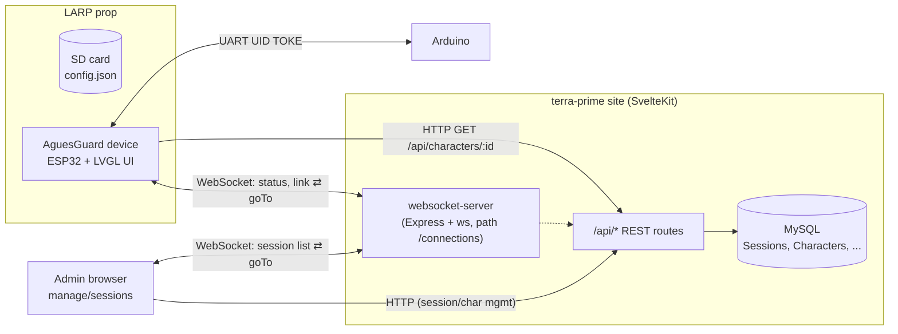
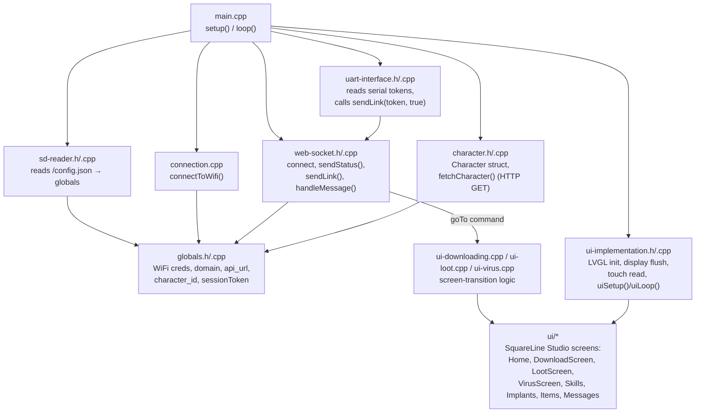
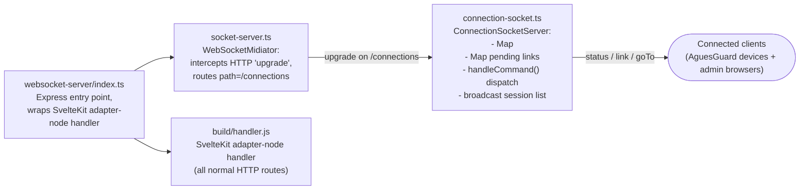
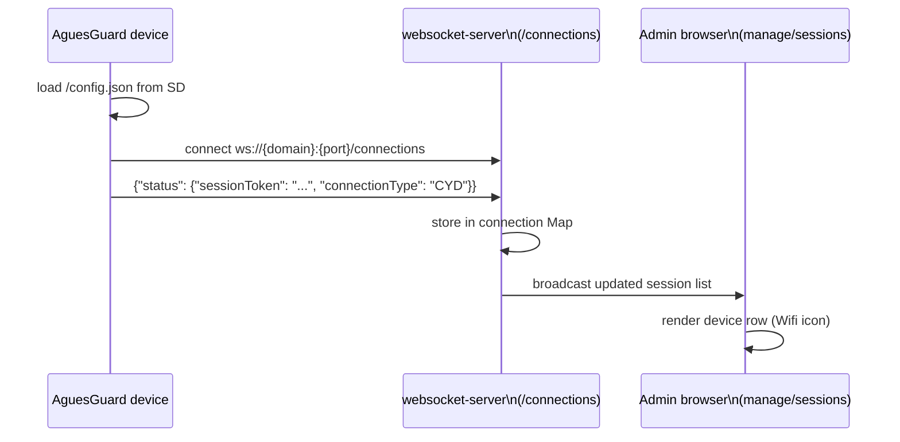
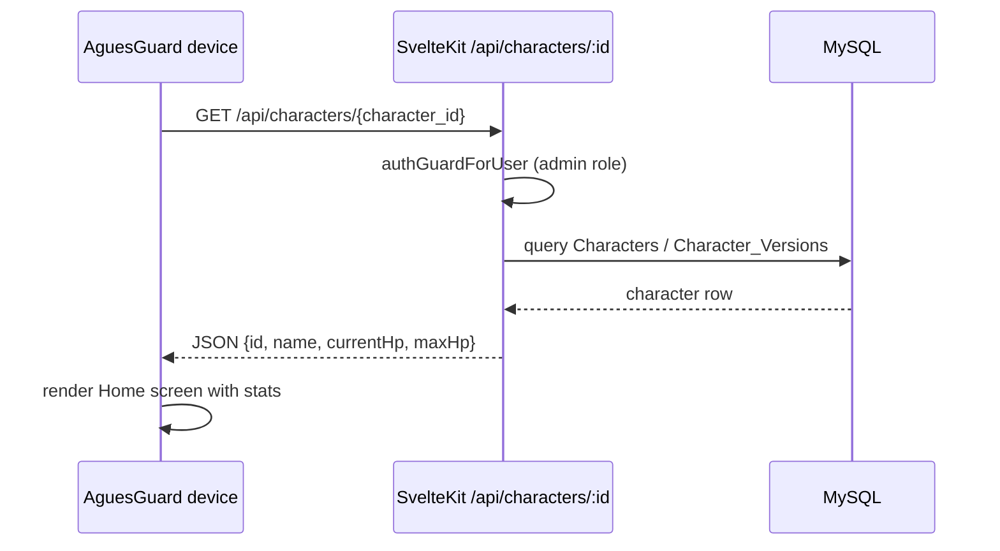
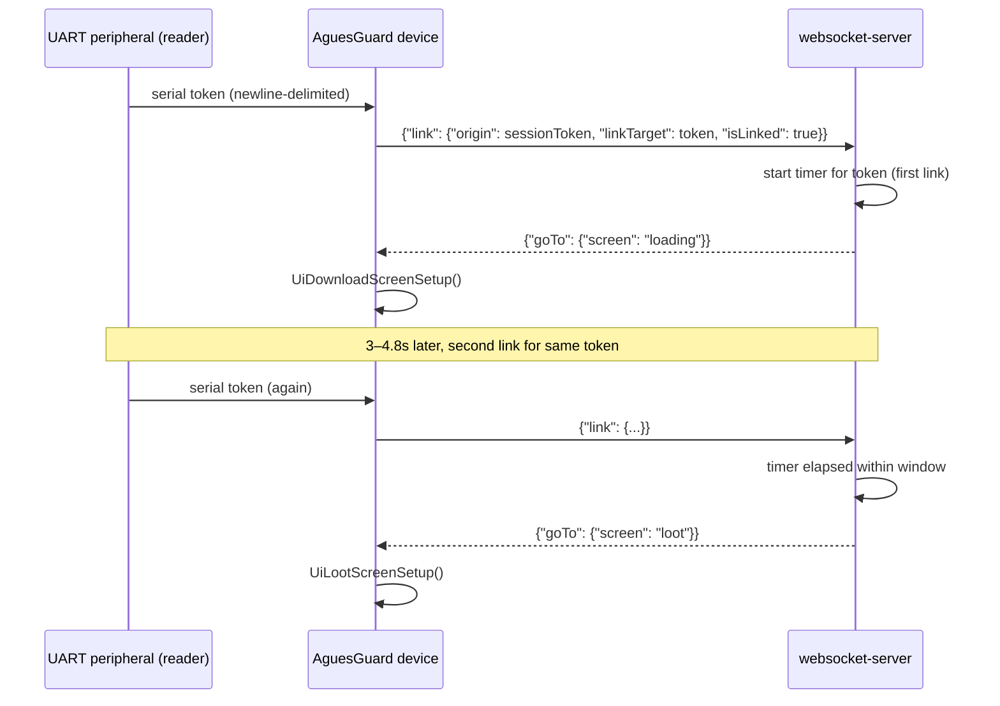
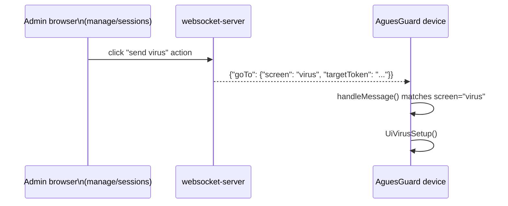

# AguesGuard Design Document

> Architecture and data-flow reference for the **AguesGuard** LARP-prop
> device and how it interacts with the terra-prime site. Diagrams are [Mermaid](https://mermaid.js.org/)
> — edit the fenced code blocks directly and re-render (e.g. on [mermaid.live](https://mermaid.live))
> to adjust them.

## 1. Overview

**AguesGuard** runs on **CYD** ("Cheap Yellow Display") hardware — a low-cost ESP32 development
board with an integrated 320x240 ILI9341 TFT screen and an XPT2046 resistive touch controller
(named after the well-known RandomNerdTutorials hardware guide). In this repo, `cyd/` is a
PlatformIO/Arduino firmware project that turns one of these boards into a **physical LARP-RPG
companion prop**:
it sits at a player's table during a live session, renders character stats and animated
screens (loading / loot / virus / skills / implants / items / messages) built with
**LVGL** + **SquareLine Studio**, and reacts in real time to commands pushed from the server.

The device is not autonomous — it is a thin client. All game logic, session state, and
character data live on the site (SvelteKit + MySQL). AguesGuard talks to the site over four channels:

| Channel | Direction | Purpose |
|---|---|---|
| HTTP (REST) | device → server | `GET /api/characters/:id` to fetch character stats |
| WebSocket (`/connections`) | bidirectional | status/link events out, screen-navigation commands in |
| UART (serial) | external peripheral → device | receives tokens (e.g. from an RFID/NFC reader), relayed as "link" events |
| SD card | local | loads `/config.json` at boot (WiFi creds, API/WS URLs, `characterId`, `sessionToken`) |

The admin-facing `manage/sessions` dashboard in the site connects to the **same** WebSocket
endpoint as every AguesGuard device, so admins can see which devices are connected live and trigger
screen changes (e.g. "send virus") on a specific device.

---

## 2. System Sturcture

---

## 3. AguesGuard firmware components

> Note: as of the current firmware, `main.cpp` boots directly into the UI with SD/WiFi/
> character-fetch/WebSocket init **commented out** (dev-mode state) — see `cyd/CLAUDE.md`.

---

## 4. Site-side realtime layer

**Discriminated connection types** (`connection-socket.ts`):
- `WebStatusCommandInfo` — `connectionType: 'Web'` (admin dashboard)
- `CYDStatusCommandInfo` — `connectionType: 'CYD'`, includes `wifiStrength`

`site/src/lib/components/session-row.svelte` renders a Wifi icon for `'CYD'` connections and
an EthernetPort icon for `'Web'` connections in the admin list.

---

## 5. Sequence diagrams

### 5.1 Boot / status handshake

### 5.2 Character fetch

> ⚠️ See [§7.3](#7-known-architecture-gaps) — the firmware currently sends no auth header,
> but this route requires an authenticated admin session.

### 5.3 Link / loot mini-game

### 5.4 Admin-triggered screen push

---

## 6. Data model touchpoints

| Table | AguesGuard reads | AguesGuard writes | Notes |
|---|---|---|---|
| `Sessions` / `Session_Roles` | `sessionToken` is provisioned into `/config.json` on the SD card out-of-band | — (no direct writes) | Identity on the WS channel is self-asserted via `sessionToken` in the `status` message; there is no per-message auth check on the socket itself |
| `Characters` / `Character_Versions` | via `GET /api/characters/:id` (`currentHp`, `maxHp`, `name`) | — | Fetched once at boot (when enabled) to populate the Home screen |

Full schema reference: `site/CLAUDE.md`. Full REST endpoint reference: `site/src/routes/api/CLAUDE.md`.

---

## 7. Known architecture gaps

These are real, current gaps found while tracing the AguesGuard ⇄ site integration — documented here
so they're visible, not silently worked around.

1. **Production entrypoint skips the WebSocket server.** `site/package.json` defines two start
   scripts: `start` (`node ./build/index.js`, plain SvelteKit adapter-node) and
   `start:websocket` (`node ./websocket-server`, the Express+`ws` wrapper that mounts
   `/connections`). `site/dockerfile`'s final stage runs `pnpm start`, and `site/railway.toml`
   does not override the command — so, as configured, the deployed container does **not**
   expose `/connections`, meaning AguesGuard devices and the `manage/sessions` live dashboard cannot
   connect in production.

2. **Hardcoded local WebSocket URL.** `site/src/routes/manage/sessions/+page.svelte` connects
   to a hardcoded `ws://localhost:5173/connections`, which will not resolve against a deployed
   domain and does not use `wss://` for TLS.

3. **Unauthenticated firmware request against a gated endpoint.** The firmware's
   `fetchCharacter()` (`cyd/src/character.cpp`) sends a plain `GET` with no auth header, but
   `GET /api/characters/[characterId]` is guarded by `authGuardForUser` (admin role). As it
   stands, this request would be rejected once auth is enforced in a deployed environment.

---

## 8. File / reference index

| Diagram element | File(s) |
|---|---|
| Firmware entry / lifecycle | `cyd/src/main.cpp` |
| Firmware shared state | `cyd/src/globals.h`, `cyd/src/globals.cpp` |
| SD config loading | `cyd/src/sd-reader.h`, `cyd/src/sd-reader.cpp` |
| WiFi connect | `cyd/src/connection.cpp` |
| WebSocket client | `cyd/src/web-socket.h`, `cyd/src/web-socket.cpp` |
| Character fetch | `cyd/src/character.h`, `cyd/src/character.cpp` |
| UART token input | `cyd/src/uart-interface.h`, `cyd/src/uart-interface.cpp` |
| LVGL/display glue | `cyd/src/ui-implementation.h`, `cyd/src/ui-implementation.cpp` |
| Screen-transition logic | `cyd/src/ui-downloading.cpp`, `cyd/src/ui-loot.cpp`, `cyd/src/ui-virus.cpp` |
| SquareLine-generated screens | `cyd/src/ui/*` |
| Firmware architecture notes | `cyd/CLAUDE.md` |
| WS Express entry point | `site/websocket-server/index.ts` |
| WS upgrade routing | `site/websocket-server/socket-server.ts` |
| Connection/link state + broadcast | `site/websocket-server/connection-socket.ts` |
| Admin live dashboard | `site/src/routes/manage/sessions/+page.svelte`, `site/src/lib/components/session-row.svelte` |
| Character REST endpoint | `site/src/routes/api/characters/[characterId]/+server.ts` |
| Site schema reference | `site/CLAUDE.md` |
| Site API reference | `site/src/routes/api/CLAUDE.md` |
| Deployment config | `site/dockerfile`, `site/railway.toml`, `site/package.json` |
