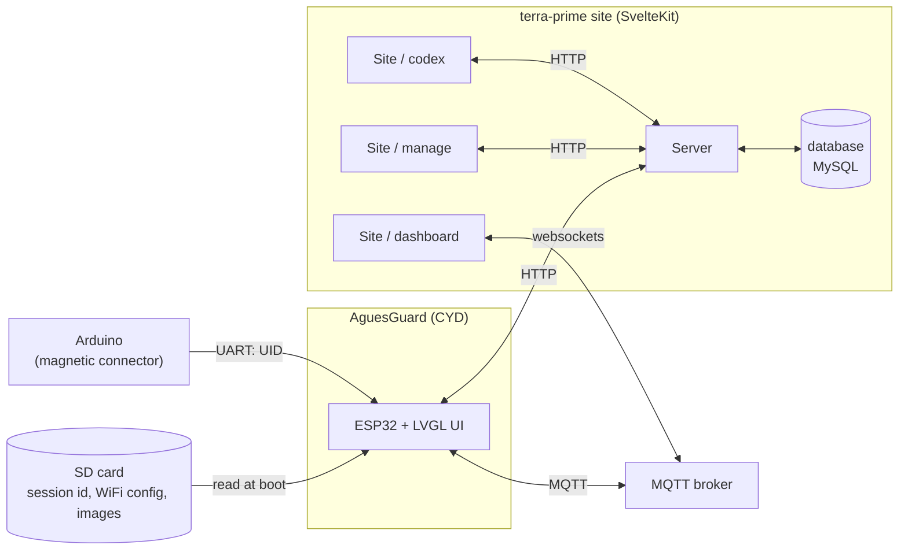
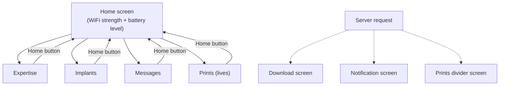
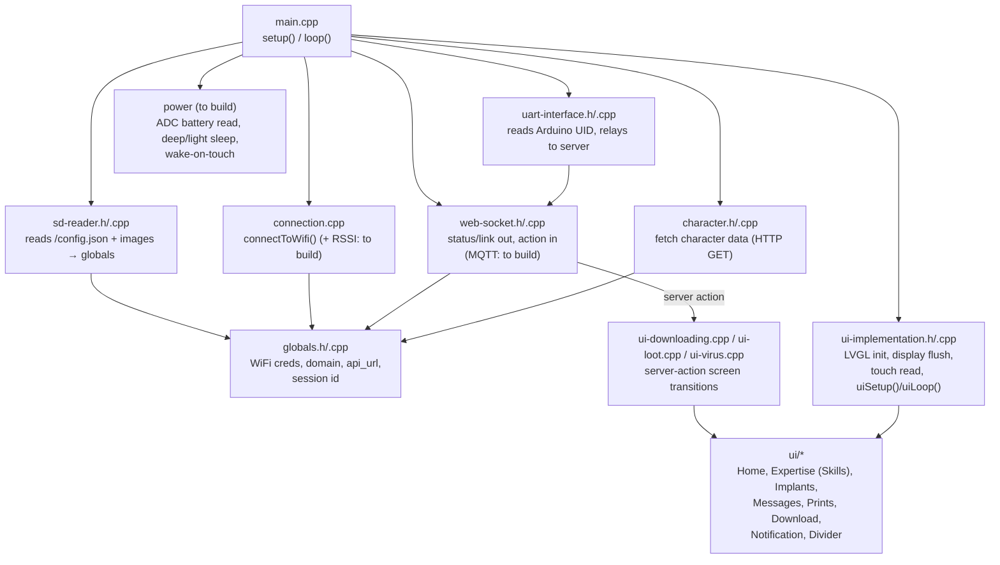

# AguesGuard Design Document

> Design and data-flow reference for the **AguesGuard** LARP device and how it
> interacts with the terra-prime site. This is a **target design** document: it
> describes where the project is going and grounds every feature in what already
> exists in the repo, calling out what still needs building in
> [§7](#7-what-needs-building). Diagrams are [Mermaid](https://mermaid.js.org/) —
> edit the fenced code blocks directly and re-render (e.g. on
> [mermaid.live](https://mermaid.live)) to adjust them.

## 1. Overview

**AguesGuard** is the software project for the **CYD** ("Cheap Yellow Display")
used at a **LARP event**. Every player carries a **battery-powered CYD** to view
their own character stats during the game.

The CYD is a low-cost ESP32 development board with an integrated 320x240 ILI9341
TFT screen and an XPT2046 resistive touch controller (named after the well-known
RandomNerdTutorials hardware guide). In this repo, `cyd/` is a PlatformIO/Arduino
firmware project that turns one of these boards into a handheld player prop: it
renders the player's expertise, implants, messages and prints (lives), plays
server-commanded animations, and reacts in real time to events pushed from the
server.

The device is a **thin client**. All game logic, session state, and character
data live on the site (SvelteKit + MySQL); the CYD renders and relays. It is
powered by **two 18650 batteries** so it can run untethered for the length of an
event, and it drops into a power-save mode (waking on touch) to conserve charge.

Each player has a **personal SD card** carrying their session id, WiFi
configuration, and images to load (such as the expertise icons).

---

## 2. Feature list

Each feature below is tagged with its current state in the repo. **Exists** =
already present; **Needs building** = described here but not yet implemented (see
[§7](#7-what-needs-building)).

### 2.1 View expertise — *catalog exists; device view to build*
Expertise is displayed as **progress bars**. The catalog and per-character values
already exist server-side: `Expertise`, `Expertise_Groups`, and
`Character_Version_Expertise` (whose `Value` column maps directly onto a progress
bar); icons were added in `site/db/migrations/0016_add_expertise_icons.sql`. The
firmware screen exists but under the **old name "Skills"**
(`cyd/src/ui/ui_Skills.c`) — a rename to "Expertise" is pending. Today expertise
has only admin routes (`site/src/routes/manage/expertise/**`), so a player-facing
read path for the device still needs building.

### 2.2 View implants — *catalog exists; device view to build*
An overview of all the player's implants, each with its description. Backed by
`Implants` (`Id`, `Name`, `Description`) and `Character_Version_Implants`; slot
and prerequisite rules live in migrations `0009`/`0010`/`0014`. Firmware screen:
`cyd/src/ui/ui_Implants.c`. Admin routes exist at
`site/src/routes/manage/implants/**`.

### 2.3 Activate implant charges — *needs building (refactor)*
Some implants have **charges** the player can activate; **refresh (recharging) is
handled by the admins**, not by the player. There is **no charge concept anywhere
today**, so this touches the database, the implant repo/API, and the manage UI.

#### 2.3.1 Data model
Charges live at two levels, mirroring how implants already split catalog vs.
per-character data:

- **Catalog** — how many charges an implant *type* grants when full. Add to the
  `Implants` table, alongside the existing `Cost`:
  `MaxCharges INT NOT NULL DEFAULT 0` (`0` = not a charged implant).
- **Instance** — the charges left on the copy a specific player carries. Add to
  the per-character join `Character_Version_Implants`, alongside the existing
  `Slot`: `ChargesRemaining INT NOT NULL DEFAULT 0`.

New migration `site/db/migrations/0017_implant_charges.sql` (next free number —
`0016` is already used twice), in the same style as `0010_implant_slots.sql`:

```sql
ALTER TABLE `Implants`
  ADD COLUMN `MaxCharges` int NOT NULL DEFAULT 0;

ALTER TABLE `Character_Version_Implants`
  ADD COLUMN `ChargesRemaining` int NOT NULL DEFAULT 0;

-- Backfill: existing implant instances start full
UPDATE `Character_Version_Implants` cvi
  JOIN `Implants` i ON i.Id = cvi.Implant
  SET cvi.ChargesRemaining = i.MaxCharges;
```

#### 2.3.2 Repo / type touchpoints
In `site/src/lib/db/implants.repo.ts`:

- Add `maxCharges` to the `Implant` type and to the `isImplants` guard.
- Select `i.MaxCharges as maxCharges` in every read (`getAll`,
  `getAllForCharacter`, `getAllAccessibleToAll`, `getWithId`, `getWithIds`).
- Add `MaxCharges` to the column lists/values in `create`, `edit`, and
  `saveBulk`.
- Add instance methods (here or on `character_version.repo.ts`):
  `spendCharge(cviId)` — `UPDATE Character_Version_Implants SET ChargesRemaining
  = ChargesRemaining - 1 WHERE Id = ? AND ChargesRemaining > 0`; and
  `refreshCharges(...)` — reset `ChargesRemaining` to the implant's `MaxCharges`
  for a character version (the admin refresh; reuse the `setCharacterAccess`
  transaction pattern).

#### 2.3.3 Manage-page changes
- **Implant form** (`site/src/lib/components/implant-form.svelte`): add a
  "max charges" number input bound to `implant.maxCharges`, next to the existing
  cost field. It flows through the current save path unchanged — the `[id]` page's
  `save()` already POSTs the whole `implant` to `POST /api/implants/[id]`, which
  calls `implantRepo.save()`; once the type and repo carry `maxCharges`, no page
  or endpoint wiring changes are needed. The `new` form reuses the same
  component, so it gets the field for free.
- **Admin refresh control**: because refresh is an admin action, add a "refresh
  charges" control where admins manage a live player — the character-version view
  under `site/src/routes/manage/characters/[id]/**` and/or the live
  `manage/sessions` dashboard — calling a new admin endpoint (e.g.
  `POST /api/characters/:id/implants/refresh`) that runs `refreshCharges` to
  reset that character's implant instances to full.

#### 2.3.4 Activation flow (device)
On the device, activating a charge calls an authenticated runtime endpoint under
`site/src/routes/api/my/**` (scoped to the player's own session) that runs
`spendCharge`; the server pushes the updated count back so the Implants screen
re-renders. This is the device-side counterpart to the admin refresh.

### 2.4 Receive messages — *table exists; delivery to build*
Players are **notified when a new message arrives**. The `Messages` table already
exists (`Id`, `Sender` → Users (nullable, for system messages), `Recipient` →
Users (NOT NULL), `Subject` varchar(512), `Message` text, `Attachment` (JSON NOT
NULL)) in `site/db/migrations/0001_initial_schema.sql`, but there is **no API, no
site UI, and no notification path** on top of it. Building it touches the
database, a new repo/API, and a new admin **send-message** manage page.

#### 2.4.1 Data model
The table is missing what delivery needs — a **read flag** (to drive the
"notify on new / unread" behaviour) and a **timestamp** (to order the list).
New migration `site/db/migrations/0018_message_delivery.sql` (after the
`0017` implant-charges migration):

```sql
ALTER TABLE `Messages`
  ADD COLUMN `CreatedAt` datetime NOT NULL DEFAULT CURRENT_TIMESTAMP,
  ADD COLUMN `ReadAt`    datetime NULL DEFAULT NULL;   -- NULL = unread
```

`Attachment` is `JSON NOT NULL`, so the compose path defaults it to `[]` when the
admin sends no attachment.

#### 2.4.2 Repo / type
New `site/src/lib/db/messages.repo.ts`, following the `implants.repo.ts` shape
(a class + singleton export + a `Message` type + an `isMessage` guard):

- `getForRecipient(userId)` — a player's messages, newest first, joining
  `Sender` → `Users` for the sender name (system messages have a null sender).
- `getUnreadCountForRecipient(userId)` — `COUNT(*) WHERE Recipient = ? AND ReadAt
  IS NULL`, for the notification badge.
- `markRead(id, userId)` — `UPDATE Messages SET ReadAt = NOW() WHERE Id = ? AND
  Recipient = ?`.
- `send({ sender, recipient, subject, message, attachment })` — insert one row
  (`sender` null = system message).
- `sendBulk(recipients, { subject, message, attachment })` — one message fanned
  out to many players, using the multi-row `INSERT ... VALUES` + transaction
  pattern already in `implantRepo.saveBulk`/`setCharacterAccess`.

#### 2.4.3 API
- **Admin send** — `POST /api/messages` (new `site/src/routes/api/messages/+server.ts`),
  `authGuardForUser(token, ['admin'])`, body `{ recipients: number[], subject,
  message, attachment? }` → `send`/`sendBulk`. Mirror the auth/validation style of
  `site/src/routes/api/implants/[id]/+server.ts`.
- **Player read** — `GET /api/my/messages` and `POST /api/my/messages/[id]/read`
  (new, under `site/src/routes/api/my/**`), scoped to the session user like the
  other `api/my` endpoints; plus `GET /api/my/messages/unread-count` for the
  badge.

#### 2.4.4 Manage page — admin sends messages to players
New route `site/src/routes/manage/messages/`, mirroring `manage/emails` /
`manage/implants`:

- `+page.svelte` + `+page.server.ts` — list of sent messages (loaded via the
  admin `GET /api/messages`), with the "add new" `CirclePlus` link above the
  table (per the manage UI convention in `site/CLAUDE.md`) pointing at the
  compose page.
- `new/+page.svelte` — compose form that POSTs to `/api/messages`: a **recipient
  multi-select**, a subject input, a message textarea, and an optional
  attachment. Recipients are `Users` (`Messages.Recipient` → `Users`), so feed
  the picker from `/api/users`; reuse the searchable multi-select pattern in
  `site/src/lib/components/character-access-select.svelte`.
- `message-form.svelte` — a form component like `implant-form.svelte` /
  `email-template-form.svelte`, bound to the draft message.

#### 2.4.5 Notification flow (device)
On send, the server pushes a notification to the recipient's connected device
over the realtime channel (today WS `/connections`, target MQTT — see
[§3](#3-data-infrastructure)); the device shows the server-requested
**Notification screen** (per [§4](#4-ui-overview)), then fetches the new message
via `GET /api/my/messages`. The unread badge comes from
`getUnreadCountForRecipient`.

### 2.5 View messages — *screen exists; data path to build*
Messages are displayed by **sender and subject**. Firmware screen:
`cyd/src/ui/ui_Messages.c`. It consumes the same delivery layer as
[§2.4](#24-receive-messages--table-exists-delivery-to-build): lists the player's
messages from `GET /api/my/messages` (sender name resolved via the `Sender` →
`Users` join), and marks one read via `POST /api/my/messages/[id]/read`.

### 2.6 View prints (lives) — *needs building (new)*
A screen, **reachable from the Home screen**, shows the player's current number
of **prints** (lives), where the player can **remove** (decrement) their own
prints. This is an **entirely new** concept — no prints/lives data exists in the
DB, site, or firmware today. It needs a print count on the character version, an
API to read and decrement it, and a firmware screen. See also the
server-navigated divider screen in [§2.7](#27-prints-divider--needs-building-new-server-navigated)
and the [UI overview](#4-ui-overview).

### 2.7 Prints divider — *needs building (new, server-navigated)*
The server can navigate the AguesGuard to a **divider screen** where a **pool of
prints is divided between players**. Like the Download and Notification screens,
it is shown **only on server request**, not from the Home menu.

### 2.8 Play download animations — *screen exists*
Playing a download animation is one of the **actions the server commands** after
a device connects to an Arduino (see [§2.9](#29-connect-to-arduinos-for-irl-interactions--partly-exists)).
Firmware screen: `cyd/src/ui/ui_DownloadScreen.c` (transition logic in
`cyd/src/ui-downloading.cpp`).

### 2.9 Connect to Arduinos for IRL interactions — *partly exists*
The CYD has a cable with a **magnetic connector** that can connect to an Arduino.
The Arduino simply sends a **UID** that the CYD **relays to the server**; the
server responds with the **action** the CYD should take (e.g. play a download
animation, show a notification, open the prints divider). The UART relay path
already exists in firmware (`cyd/src/uart-interface.cpp` →
`cyd/src/web-socket.cpp`). The legacy loot/virus mini-game
(`cyd/src/ui-loot.cpp`, `cyd/src/ui-virus.cpp`, `ui_LootScreen.c`,
`ui_VirusScreen.c`) is superseded by this generic **UID → server action** model;
those screens remain available for reuse as server-commanded actions.

### 2.10 View battery level — *needs building*
The CYD is powered by **two 18650 batteries**; the Home screen shows the current
battery level. A `battery-full.png` asset exists
(`cyd/src/ui/drive/assets/`), but there is **no ADC voltage read** in firmware
yet.

### 2.11 Power-save mode — *needs building*
The device goes into **power-save mode** and **wakes up on touch** to preserve
battery. No deep/light-sleep handling exists in firmware today.

### 2.12 View WiFi strength — *needs building*
The Home screen shows **WiFi strength**. A WiFi status-bar icon asset exists
(`cyd/src/ui/ui_img_wifi_png.c`) and the WebSocket protocol already declares a
`wifiStrength` field (`site/websocket-server/connection-socket.ts`), but the
firmware does not yet read RSSI or populate it (`cyd/src/connection.cpp` does a
plain connect only).

### 2.13 Read data on SD — *exists*
Every player has a **personal SD card** with their information: personal session
id, WiFi configuration, and images to load such as the expertise icons. The
firmware reads `/config.json` at boot (`cyd/src/sd-reader.cpp` → globals).

---

## 3. Data infrastructure



Channels:

| Channel | Endpoints | Purpose |
|---|---|---|
| SD | SD → AguesGuard | Boot config (session id, WiFi), images/icons |
| UART | Arduino → AguesGuard | Relayed UID from the magnetic connector |
| MQTT | AguesGuard ⇄ broker | Device telemetry out, server actions in |
| HTTP | AguesGuard ← server | Fetch character/expertise/implant/message/print data |
| WebSockets | Site dashboard ⇄ broker | Live device view for admins |
| HTTP | Site manage ← server | Admin management UI |
| HTTP | Site codex ← server | Player-facing codex UI |
| — | Server ⇄ database | Persistence |

> **Current state vs. target.** MQTT is the **target** transport for the device
> and the admin dashboard. Today, both the device and the `manage/sessions`
> dashboard use a single WebSocket endpoint `/connections`
> (`site/websocket-server/*`, `cyd/src/web-socket.cpp`); there is **no MQTT in
> the repo yet**. See [§7](#7-what-needs-building).

---

## 4. UI overview



- **Home screen** — entry point, with navigation to **Expertise**, **Implants**,
  **Messages**, and **Prints (lives)**. Displays **WiFi strength** and **battery
  level**.
- **Every page has a Home button** to navigate back to Home.
- **Download screen** — displayed **only on request of the server** (an action
  after an Arduino connect).
- **Notification screen** — displayed **only on request of the server** (new
  message received).
- **Prints divider screen** — displayed **only on request of the server**, for
  dividing a pool of prints between players.

---

## 5. Firmware components



> Note: as of the current firmware, `main.cpp` boots directly into the UI with
> SD/WiFi/character-fetch/network init **commented out** (dev-mode state) — see
> `cyd/CLAUDE.md`.

---

## 6. Data model touchpoints

Full schema reference: `site/CLAUDE.md`. Full REST endpoint reference:
`site/src/routes/api/CLAUDE.md`.

| Feature | Tables | State |
|---|---|---|
| Expertise | `Expertise`, `Expertise_Groups`, `Character_Version_Expertise` (`Value`) | Exists (manage-only routes) |
| Implants | `Implants`, `Character_Version_Implants` | Exists (manage-only routes) |
| Implant charges | `Implants.MaxCharges` (catalog) + `Character_Version_Implants.ChargesRemaining` (instance) | Needs building — see [§2.3](#23-activate-implant-charges--needs-building-refactor) |
| Messages | `Messages` (`Sender`, `Recipient`, `Subject`, `Message`, `Attachment`) + new `CreatedAt` / `ReadAt` | Table exists; repo + API + admin send page + delivery to build — see [§2.4](#24-receive-messages--table-exists-delivery-to-build) |
| Prints (lives) | *(new print count on `Character_Versions` + divider pool)* | Needs building |
| Session identity | `Sessions` / `Session_Roles` — `sessionToken` provisioned to the SD card out-of-band | Exists |

---

## 7. What needs building

Real, current gaps between this target design and the code — documented so
they're visible, not silently assumed.

1. **MQTT transport.** The target device/dashboard transport is MQTT (device ⇄
   broker, dashboard ⇄ broker over websockets). Today both use a single WebSocket
   `/connections` endpoint (`site/websocket-server/*`, `cyd/src/web-socket.cpp`);
   there is no MQTT broker, client, or config anywhere in the repo.
2. **Implant charges.** No charge concept exists. Needs DB (`Implants.MaxCharges`
   + `Character_Version_Implants.ChargesRemaining`, migration
   `0017_implant_charges.sql`), repo `spendCharge`/`refreshCharges` methods, a
   "max charges" field on the implant manage form, a device activation endpoint
   under `api/my/**`, and an admin refresh endpoint/control. Full design in
   [§2.3](#23-activate-implant-charges--needs-building-refactor).
3. **Messages API + notifications.** The `Messages` table exists but has no
   `CreatedAt`/`ReadAt` columns (migration `0018_message_delivery.sql`), no repo
   (`messages.repo.ts`: `getForRecipient`, `getUnreadCountForRecipient`,
   `markRead`, `send`, `sendBulk`), no API (admin `POST /api/messages`, player
   `GET/POST /api/my/messages`), no **admin send-message manage page**
   (`manage/messages/**`), and no push/notification path to drive the device
   Notification screen. Full design in
   [§2.4](#24-receive-messages--table-exists-delivery-to-build).
4. **Prints (lives).** Entirely new: a print count on the character version, an
   API to read/decrement, a Home-accessible view+decrement screen, and a
   server-navigated divider screen for splitting a pool between players.
5. **Battery level.** No ADC voltage read for the 2× 18650 pack (only a static
   `battery-full.png` asset).
6. **Power-save + wake-on-touch.** No ESP deep/light-sleep handling in firmware.
7. **WiFi strength.** No RSSI read; `wifiStrength` is declared in the WS protocol
   (`connection-socket.ts`) but never populated by firmware.
8. **Player-facing data on device.** Expertise and implants have only `/manage`
   routes; a read path scoped to the player's own session is needed for the
   device.
9. **Firmware "Skills" → "Expertise" rename.** The site renamed skills to
   expertise (`0013_rename_skills_to_expertise.sql`); the firmware screen is
   still `ui_Skills.c`.

Carried-over integration gaps (still valid):

10. **Production entrypoint skips the realtime server.** `site/package.json`
    defines `start` (plain adapter-node) and `start:websocket` (the Express+`ws`
    wrapper that mounts `/connections`). `site/dockerfile` runs `pnpm start` and
    `site/railway.toml` does not override it — so the deployed container does not
    expose the realtime endpoint.
11. **Hardcoded local WebSocket URL.**
    `site/src/routes/manage/sessions/+page.svelte` connects to a hardcoded
    `ws://localhost:5173/connections` (not the deployed domain, not `wss://`).
12. **Unauthenticated firmware request against a gated endpoint.**
    `fetchCharacter()` (`cyd/src/character.cpp`) sends a plain `GET` with no auth
    header, but the character REST route is guarded by `authGuardForUser` (admin
    role).

---

## 8. File / reference index

| Area | File(s) |
|---|---|
| Firmware entry / lifecycle | `cyd/src/main.cpp` |
| Firmware shared state | `cyd/src/globals.h`, `cyd/src/globals.cpp` |
| SD config + image loading | `cyd/src/sd-reader.h`, `cyd/src/sd-reader.cpp` |
| WiFi connect (RSSI: to build) | `cyd/src/connection.cpp` |
| Realtime client (MQTT: to build) | `cyd/src/web-socket.h`, `cyd/src/web-socket.cpp` |
| Character fetch (HTTP) | `cyd/src/character.h`, `cyd/src/character.cpp` |
| Arduino UID input (UART) | `cyd/src/uart-interface.h`, `cyd/src/uart-interface.cpp` |
| LVGL/display glue | `cyd/src/ui-implementation.h`, `cyd/src/ui-implementation.cpp` |
| Server-action screen transitions | `cyd/src/ui-downloading.cpp`, `cyd/src/ui-loot.cpp`, `cyd/src/ui-virus.cpp` |
| SquareLine-generated screens | `cyd/src/ui/*` (Home, Skills→Expertise, Implants, Messages, Items, DownloadScreen, LootScreen, VirusScreen) |
| Firmware architecture notes | `cyd/CLAUDE.md` |
| Realtime server (current WS) | `site/websocket-server/index.ts`, `socket-server.ts`, `connection-socket.ts` |
| Admin live dashboard | `site/src/routes/manage/sessions/+page.svelte`, `site/src/lib/components/session-row.svelte` |
| Expertise (admin) | `site/src/routes/manage/expertise/**`, `site/src/routes/api/expertise/**` |
| Implants (admin) | `site/src/routes/manage/implants/**`, `site/src/routes/api/implants/**` |
| Messages (admin send: to build) | `site/src/routes/manage/messages/**`, `site/src/routes/api/messages/**`, `site/src/routes/api/my/messages/**`, `site/src/lib/db/messages.repo.ts` |
| Recipient/user list (reuse) | `site/src/routes/api/users/**`, `site/src/lib/components/character-access-select.svelte` |
| Codex (player UI) | `site/src/routes/codex/**` |
| Character REST endpoint | `site/src/routes/api/characters/[characterId]/+server.ts` |
| Schema (incl. `Messages`) | `site/db/migrations/0001_initial_schema.sql`, `site/CLAUDE.md` |
| Site API reference | `site/src/routes/api/CLAUDE.md` |
| Deployment config | `site/dockerfile`, `site/railway.toml`, `site/package.json` |
