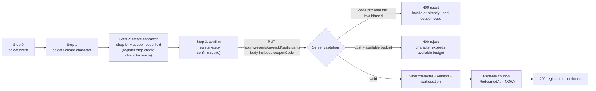
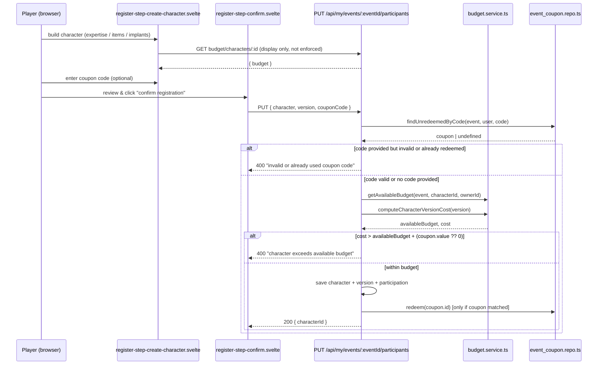

# Replace per-character "extra budget" with a redeemable event coupon system

## Context

Admins currently grant characters extra budget for a specific event via
`site/src/routes/manage/events/[id]/budget/`, backed by a single
`Event_Character_Budget(Event, Character)` row per character holding one
mutable `Budget` number. This is being replaced with a coupon system: a
discrete, admin-managed grant tied to one player and one event, redeemed by
the player entering a code during character registration. For now a coupon
only grants extra budget, but the model allows adding other coupon kinds
(unlocking expertise/items/implants) later without a schema rewrite.

Decisions confirmed with the user:
- **Multiple coupons per (event, player) are allowed** — each is its own row, not one mutable value.
- **Coupons target the User (player)**, not the Character — the grant follows the player, independent of which character they bring.
- **Redemption is gated by code entry**: a coupon has a `Redeemed` state. Its value only counts toward budget once the player enters the matching code; admin-created coupons don't auto-apply.
- **Server-side budget enforcement is new**: today nothing stops a submitted character from exceeding budget — `character-create-nav.svelte`/`character-version-shop.svelte` only compute "spent" for display. The registration save endpoint will now recompute cost server-side and reject if it exceeds the available budget (base + prior reward + redeemed coupons). This also fixes an existing double-count bug where `initializeBudgetIfMissing` seeded `event.budget + priorReward` into the old table and the lookup endpoint added `event.budget` and `priorReward` again on top.

This is a dev-only feature being removed, so the migration drops
`Event_Character_Budget` outright (any previously entered manual amounts are
lost — acceptable given the feature is being replaced).

## Registration data flow

Overall step flow through the registration wizard, showing where the new coupon field sits and where the two server-side checks (coupon code, budget) happen:



Sequence of the authoritative double-check at submission time (client display fetch vs. server-side re-validation):



## Data model

New migration `site/db/migrations/0016_event_coupons.sql`:
```sql
DROP TABLE IF EXISTS Event_Character_Budget;

CREATE TABLE `Event_Coupons` (
  `Id` int NOT NULL AUTO_INCREMENT,
  `Event` int NOT NULL,
  `User` int NOT NULL,
  `Code` varchar(64) NOT NULL,
  `Type` ENUM('budget') NOT NULL DEFAULT 'budget',
  `Value` int NOT NULL DEFAULT 0,
  `RedeemedAt` datetime DEFAULT NULL,
  PRIMARY KEY (`Id`),
  UNIQUE KEY `ec_code` (`Code`),
  KEY `ec_event_user` (`Event`, `User`),
  CONSTRAINT `ec_event` FOREIGN KEY (`Event`) REFERENCES `Events`(`Id`),
  CONSTRAINT `ec_user` FOREIGN KEY (`User`) REFERENCES `Users`(`Id`)
) ENGINE=InnoDB DEFAULT CHARSET=utf8mb4 COLLATE=utf8mb4_0900_ai_ci;
```
`Type` is included now (even though only `'budget'` is implemented) so future
coupon kinds are additive migrations instead of a data-model rewrite. `Code`
is a short, human-typeable string (not a UUID) generated server-side at
creation — no existing short-code generator exists in the codebase (session
tokens use `uuidv4()` via the `uuid` package in `session.repo.ts`, which is
too long for manual entry), so a small generator is added directly in the
new repo.

## Backend changes

- Delete `site/src/lib/db/event_budget.repo.ts`.
- Add `site/src/lib/db/event_coupon.repo.ts` (same style as the deleted repo — `await mysqlconnFn()`, no ORM):
  - `getAllByEvent(eventId)` → joins `Users`, returns `EventCoupon[]` (`{ id, userId, userName, code, type, value, redeemed }`), `redeemed = RedeemedAt != null`.
  - `getRedeemedBudgetSumForUser(eventId, userId)` → `SUM(Value) WHERE Event=? AND User=? AND Type='budget' AND RedeemedAt IS NOT NULL`.
  - `create(eventId, userId, value)` → generates a short code (e.g. 8-char uppercase alphanumeric, excluding ambiguous characters), inserts, returns `{ id, code }`.
  - `delete(couponId)`.
  - `findUnredeemedByCode(eventId, userId, code)` → returns `{ id, value } | undefined`, scoped to event+user so a code can't be redeemed by the wrong player or on the wrong event.
  - `redeem(couponId)` → sets `RedeemedAt = NOW()`.
- Add `site/src/lib/server/budget.service.ts` (new service file, following the `*.service.ts` convention already used for `email.service.ts`, `event-sheet.service.ts` etc.):
  - `getAvailableBudget({ eventId, characterId, ownerId })` → `event.budget + eventParticipantsRepo.getSumPriorRewardBudget(...) + eventCouponRepo.getRedeemedBudgetSumForUser(...)`. Reuses `eventRepo.getWithId` and `eventParticipantsRepo.getSumPriorRewardBudget`, same as today, minus the seeded row.
  - `computeCharacterVersionCost(version: CharacterVersionBare)` → server-side reimplementation of the cost math already in `character-version-shop.svelte` (`expertiseSpent + itemsSpent + implantsSpent`, using `expertiseRepo.getAll()`, `itemRepo.getAll()`, `implantRepo.getAll()` for `.cost`, and `companyDiscountsRepo.getByCompany(version.company)` for discounts when `version.company` is set).
- Delete `site/src/routes/api/events/[eventId]/budget/+server.ts` (superseded by the coupons list).
- Add `site/src/routes/api/events/[eventId]/coupons/+server.ts`:
  - `GET` (admin) → `eventCouponRepo.getAllByEvent(eventId)`.
  - `POST` (admin) → body `{ userId: number, value: number }`, calls `eventCouponRepo.create`, returns `{ id, code }` so the admin UI can display/share the code.
- Add `site/src/routes/api/events/[eventId]/coupons/[couponId]/+server.ts`:
  - `DELETE` (admin) → `eventCouponRepo.delete(couponId)`.
- Update `site/src/routes/api/events/[eventId]/budget/characters/[characterId]/+server.ts` (kept — still backs the registration flow's total-budget display, so it isn't part of the admin UI being removed):
  - Keep only `GET`, drop `POST` (superseded by the coupons endpoints).
  - Rewrite `GET` to resolve `character.ownerId` via `characterRepo.getById(characterId)`, then return `{ budget: await getAvailableBudget({ eventId, characterId, ownerId: character.ownerId }) }` — removes the double count.
- In `site/src/routes/api/events/[eventId]/participants/+server.ts` (admin-facing): remove the `eventBudgetRepo` import and the trailing `autoBudget`/`initializeBudgetIfMissing` block. No coupon/budget enforcement is added here — admins can add participants freely, same as today.
- In `site/src/routes/api/my/events/[eventId]/participants/+server.ts` (player-facing registration/edit — this is where the new checks belong):
  - Remove the `eventBudgetRepo` import and `autoBudget`/`initializeBudgetIfMissing` block.
  - Accept an optional `couponCode?: string | null` on the request body (loosen `isCharacterWithVersions`'s usage site, not the type guard itself — read it separately with a `typeof body?.couponCode === 'string'` check).
  - After resolving `characterId` and `lastVersion`, and after the existing `maxPerCharacter` item check:
    - If a non-empty `couponCode` was submitted, call `eventCouponRepo.findUnredeemedByCode(eventId, userId, couponCode)`; if not found, `throw new BadRequest('invalid or already used coupon code')`.
    - Compute `availableBudget = await getAvailableBudget({ eventId, characterId, ownerId: userId })` and `cost = await computeCharacterVersionCost(lastVersion)`.
    - If `cost > availableBudget + (coupon?.value ?? 0)`, `throw new BadRequest('character exceeds available budget')`.
  - After the existing `eventParticipantsRepo.participate(...)` call succeeds, if a coupon was matched, call `eventCouponRepo.redeem(coupon.id)`.

## Frontend changes

- Delete the `site/src/routes/manage/events/[id]/budget/` directory.
- Add `site/src/routes/manage/events/[id]/coupons/+page.server.ts`, loading `coupons` (`/api/events/{id}/coupons`) and `allUsers` (`/api/users`) in parallel via `handleRequest`, matching the deleted `budget/+page.server.ts` pattern.
- Add `site/src/routes/manage/events/[id]/coupons/+page.svelte`, following the `manage/CLAUDE.md` "add new" convention (`CirclePlus` button above the `<table>`, `drafts: Draft[]` state, append at top of `<tbody>`, save calls the create endpoint then `invalidateAll()`):
  - `Draft = { key: number; userId: number | null; value: number }`.
  - Draft row: `SearchSelect` over all users (`label: "${name} (${email})"`) + number input for the budget value + save/cancel. On save, `POST /api/events/{id}/coupons`, then show the returned `code` in the success toast (e.g. `Coupon saved — code: ${code}`) so the admin can hand it to the player, then `invalidateAll()`.
  - Existing coupon rows (read-only): `userName`, `code`, `value`, a redeemed/unredeemed indicator, and a `delete` button calling `DELETE /api/events/{id}/coupons/{couponId}` then `invalidateAll()`. No inline edit — correcting a coupon means delete + re-add.
- In `site/src/routes/manage/events/[id]/+page.svelte`, change `<a href="{event.id}/budget">Manage Budget →</a>` to `<a href="{event.id}/coupons">Manage Coupons →</a>`.
- `site/src/lib/managers/register-manager.svelte.ts`: add `couponCode` state (`let couponCode = $state('')`) with a getter/setter in the returned object, and reset it in `reset()` (and in `selectEvent()`, since a code is scoped to one event).
- `site/src/lib/components/register-step-create-character.svelte`: add a text input bound to `REGISTER_MANAGER.couponCode` (labelled e.g. "coupon code", optional) near the existing budget display. This is display/entry only — no live validation call, per the minimal scope agreed; validation happens once, authoritatively, at final submission.
- `site/src/lib/components/register-step-confirm.svelte`:
  - In `confirm()`, include `couponCode: REGISTER_MANAGER.couponCode?.trim() || null` as an extra field on the JSON body sent to `PUT /api/my/events/{eventId}/participants`.
  - Improve the error path: instead of the generic `registration failed (${res.status})`, parse the JSON error body (SvelteKit's `error()` helper returns `{ message }`) and surface `data.message` when present, so the player sees "invalid or already used coupon code" or "character exceeds available budget" rather than a generic failure.

## Docs

- Add an "Event Coupons" section to `site/src/routes/api/CLAUDE.md` (alongside "Event Participants") documenting the two new endpoints and the updated `couponCode` field on `PUT /api/my/events/[eventId]/participants`.

## Verification

- `npm run check` (or the project's svelte-check script) inside `site/` to confirm no type errors after removing `event_budget.repo.ts` and its imports.
- Run the new migration against a local/dev DB (`site/db/migrate.ts`) and confirm `Event_Character_Budget` is dropped and `Event_Coupons` exists.
- Manually exercise in the browser:
  - Open an event's manage page → "Manage Coupons" → add a coupon for a player with a value, confirm the code is shown, appears in the list, and can be deleted.
  - As that player, go through registration: enter a wrong code → confirm submission is rejected with the specific error; enter the correct code → confirm submission succeeds and the coupon's value is now included in subsequent budget lookups (and shows as redeemed in the admin list); try redeeming the same code again → rejected.
  - Build a character whose cost exceeds the available budget (with no valid coupon) and confirm the server rejects the save with the "exceeds available budget" message, even though nothing currently stops this in the UI.
